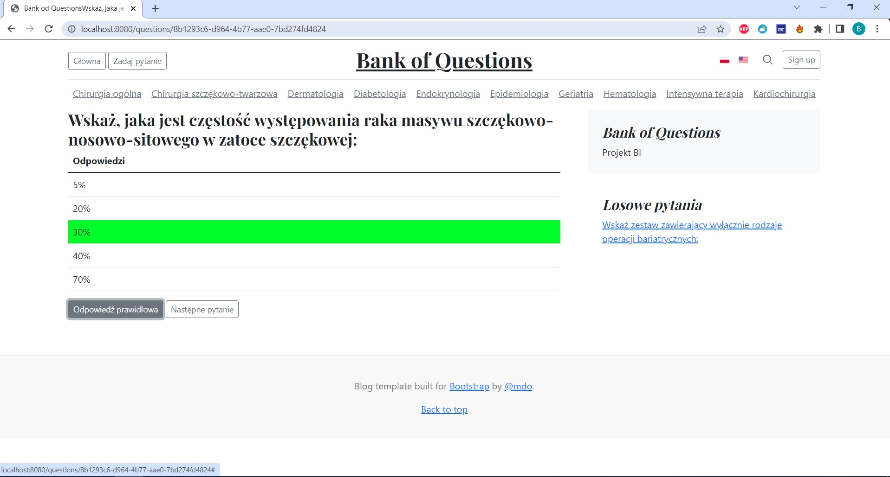
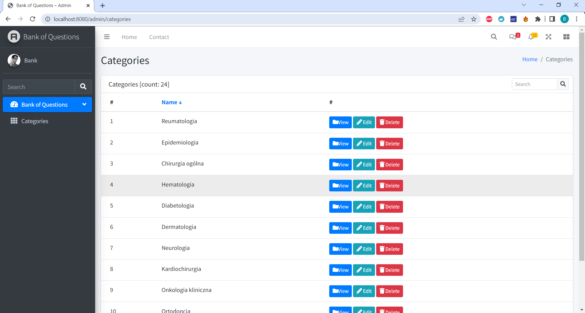

# 📝Aplikacja Bank of Questions
Aplikacja zawierająca bank pytań z poprawnymi odpowiedziami z różnych kategorii

## 📖 Spis treści
* [Informacje ogólne](#informacje-ogólne)
* [Zastosowane technologie](#zastosowane-technologie)
* [Zrzuty ekranu](#zrzuty-ekranu)
* [Wymagane aplikacje/narzędzia](#wymagane-aplikacje-narzedzia)
* [Ustawienia](#ustawienia)
* [Autorzy](#autorzy)

## 📑 Informacje ogólne

Bank of Questions to aplikacja webowa zawierająca bank pytań z poprawnymi odpowiedziami z różnych kategorii. Aplikacja umożliwia tworzenie kategorii, dodawanie pytań oraz poprawnych odpowiedzi.
Celem projektu jest stworzenie prostej i intuicyjnej aplikacji webowej, która pomoże w nauce.
Aplikacja jest oparta na architekturze REST i wzorcu projektowym MVC (Model-View-Controller).
Projekt został napisany w języku Java z wykorzystaniem frameworka Spring Boot 2 oraz narzędzia Maven. Aplikacja korzysta z bazy danych PostgreSQL, a do interfejsu użytkownika wykorzystujemy bibliotekę Thymeleaf.

## Zastosowane technologie
### ⛓️ Development
- [Java 17](https://openjdk.org/projects/jdk/17/)
- [Spring Boot 2](https://spring.io/projects/spring-boot)
- [Spring Data](https://spring.io/projects/spring-data)
- [PostgreSQL (docker)](https://www.postgresql.org/)
- [Maven 3.x](https://maven.apache.org/)
- [Git](https://git-scm.com/)

### 🩺 Testy
- [JUnit5](https://junit.org/junit5/)
- [Mockito](https://site.mockito.org/)

## 👉 Zrzuty ekranu

## 🧰 Wymagane aplikacje/narzędzia
Do uruchomienia aplikacji wymagana jest instalacja następujących narzędzi:

- [IntelliJ IDEA](https://www.jetbrains.com/idea/),
- [Java 17](https://openjdk.org/projects/jdk/18/)
- [Maven 3.x](https://maven.apache.org/download.cgi),
- [Docker](https://docs.docker.com/get-docker/)

## ⚙️ Ustawienia

Aby rozpocząć należy sklonować repozytorium lokalnie:

- git clone: https://github.com/bartoszIgnac/bankOfQuestions.git

W celu uruchomienia aplikacji z profilu:

- produkcyjnego

        Przed uruchomiemiem aplikacji należy skonfigurować bazę danych oraz serwer w kilku krokach:

        Stworzyć połączenie bazy danych z dokerem poprzez wpisanie komendy:

        docker run --name bankOfQuestions -e POSTGRES_PASSWORD=password -d -p 5432:5432 postgres

        Połączenie z serwerem:

        Login: postgres

        Hasło: password

- developerskiego

        Należy uruchomić aplikację.

## Autorzy
💻 Autorem aplikacji jest Bartosz Ignac
